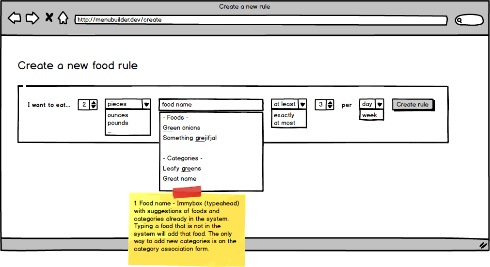
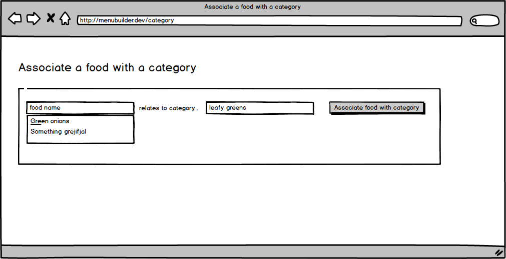

# Phase 1

## Objectives

* Create new rules
* Associate foods with categories
* I have eaten...

## Create new rules

Allows the user to enter new rules for the types of food to be eaten and the frequency those foods should be eaten.

Fields:

* Food (or category) name
* Occurence - Dropdown
  * At least
  * At most
  * Exactly
* Unit - Dropdown
  * oz
  * lb
  * piece
  * ...others?
* Time
  * day
  * week
  * month

## Associate foods with categories

Allows the user to tie a food to 1 or more categories. For instance, one could add hamburger into a red meat category.

Fields

* Food 
* Category(ies) - String, acts like tags

## I have eaten...

Allows the user to report back to the system with what was eaten on a given day, allowing the system to chart progress and how successful the user has been with meeting goal rules.

Fields:

* Date (default to today)
* Food - Dropdown, driven by rules created for food/category
  * Food name
  * Category name
* Quantity - Number
